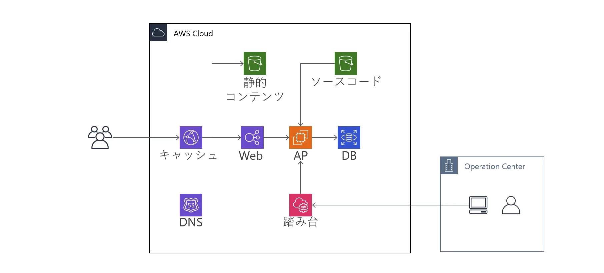

https://www.udemy.com/course/iac-with-terraform/

# prerequisites

## tfenv

- `brew install tfenv`
- `tfenv list-remote` or `tfenv list`
- `tfenv install x.x.x`
- `tfenv use x.x.x`

## 既存リソースの import

- `terraform import aws_route53_zone.existing_zone {HOST_ZONE_ID}`
  - HOST_ZONE_ID はマネジメントコンソールで確認のこと
- `terraform import aws_acm_certificate.existing_cerfiticate {ARN}`
  - ARN はマネジメントコンソールで確認のこと

# 構成

### 概要

### 詳細

# CLI

- 適用
  - `terraform apply`
- 削除
  - `terraform destroy`
- コンソール
  - `terraform console`
  - 関数とかを試せる
- リソース一覧
  - `terraform state list`
- リソース詳細
  - `terraform state show <ADDRESS>`
  - <ADDRESS>はリソース一覧で表示される文字列
- リソース名の変更
  - `terraform state mv <SRC_ADDRESS> <DST_ADDRESS>`
  - 上記コマンドにより tfstate でのリソース名が更新される（tf ファイルで別途リソース名を更新する必要がある点に注意する）
- tfstate にリソースを取り込む
  - `terraform import <ADDRESS> <ID>`
  - ex. `terraform import aws_instance.imported i-00000000000`
- リソースを tf 管理対象外にする = tfstate から削除する
  - `terraform state rm <ADDRESS>`
- 実際のクラウド上の状態を tfstate に反映する
  - `terraform refresh`
- 依存関係の可視化
  - `terraform graph > <FILENAME>`で依存関係を表現する DOT 形式のファイルを出力
  - DOT を可視化する（ex. vscode graphviz extension）

# HCL

- for（python の内包表記みたいなやつ）
  - list/set -> list
    - `[for s in var.list : upper(s)]`
  - list/set -> map
    - `{for s in var.list : s => upper(s)}`
  - map -> list
    - `[for k, v in var.map : upper(v)]`
  - map -> map
    - `{for k, v in var.map : k => upper(v)}`

# 後片付け

- 削除したくないリソース管理対象外とする
  - `terraform state rm aws_route53_zone.existing_zone`
  - `terraform state rm aws_acm_certificate.existing_cerfiticate`
- `terraform destroy`
