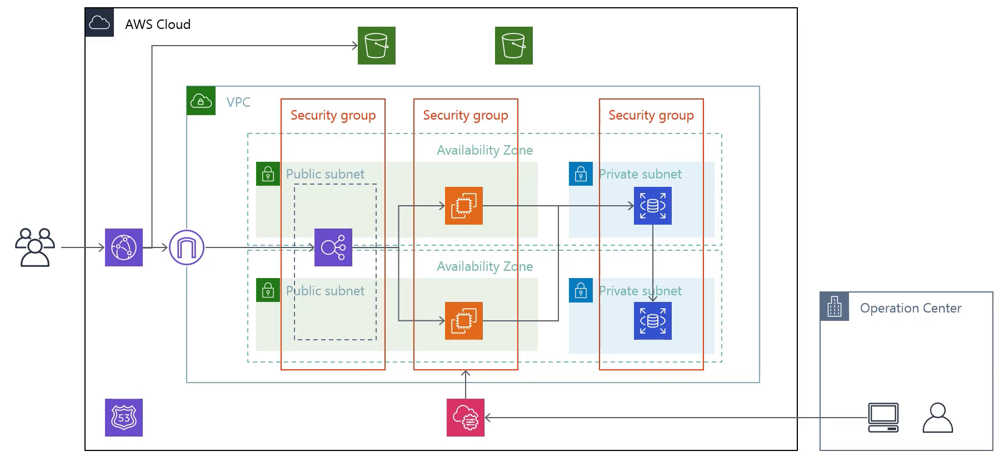

https://www.udemy.com/course/iac-with-terraform/

# prerequisites

- `brew install tfenv`
- `tfenv list-remote` or `tfenv list`
- `tfenv install x.x.x`
- `tfenv use x.x.x`

# 構成

### 概要

### 詳細

# howto

- `terraform apply`
- `terraform destroy`
